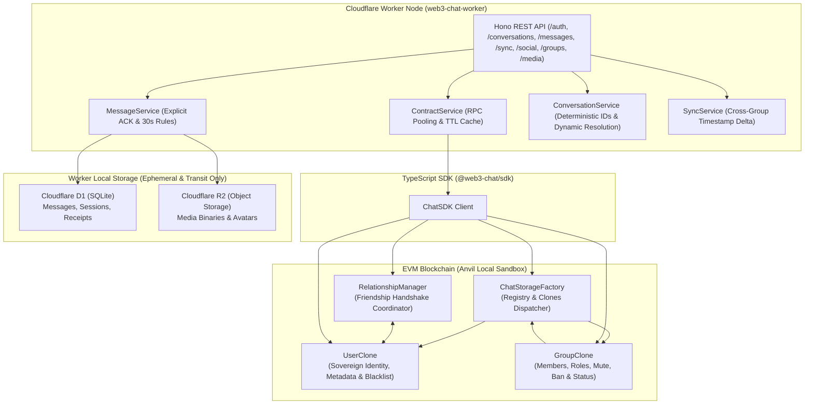
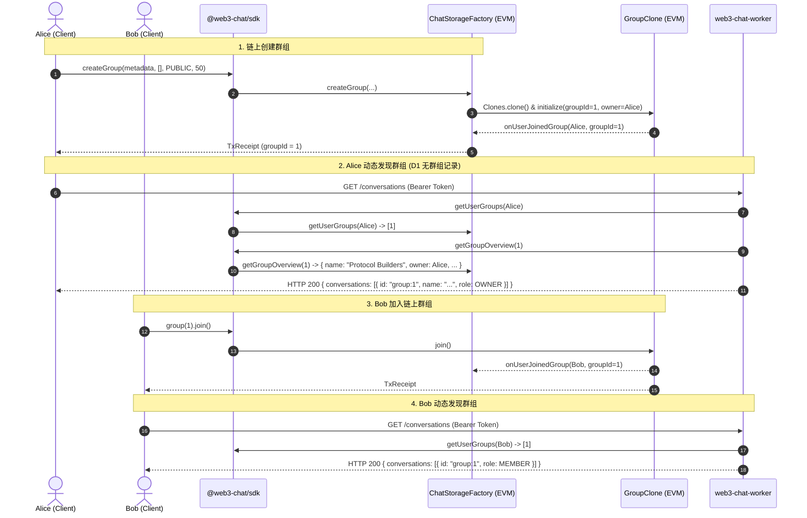
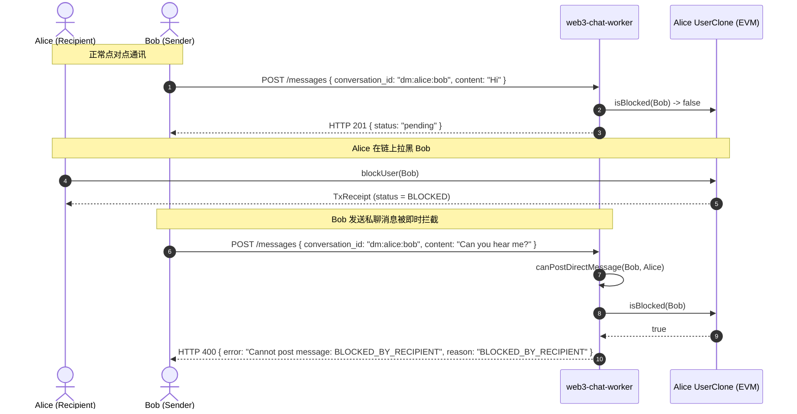
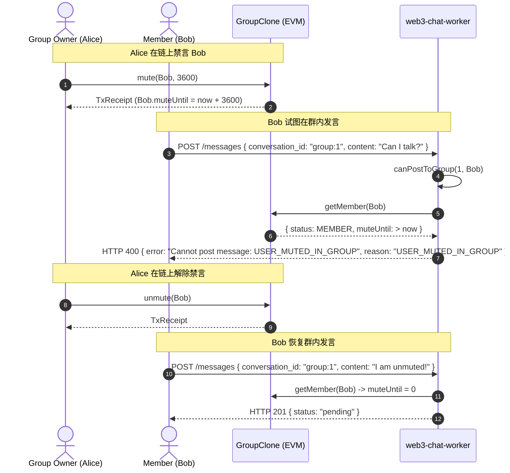
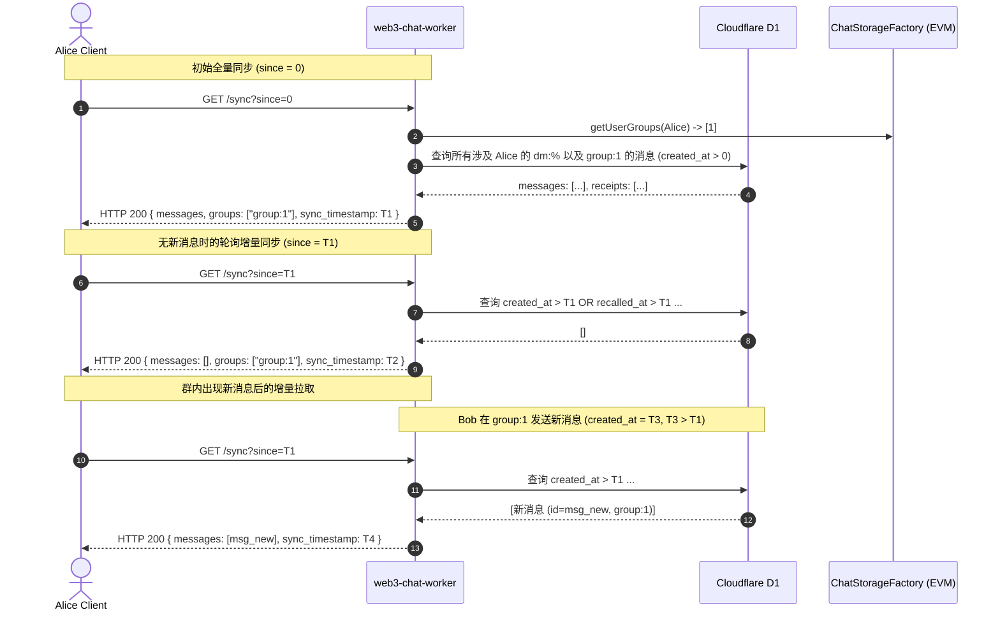
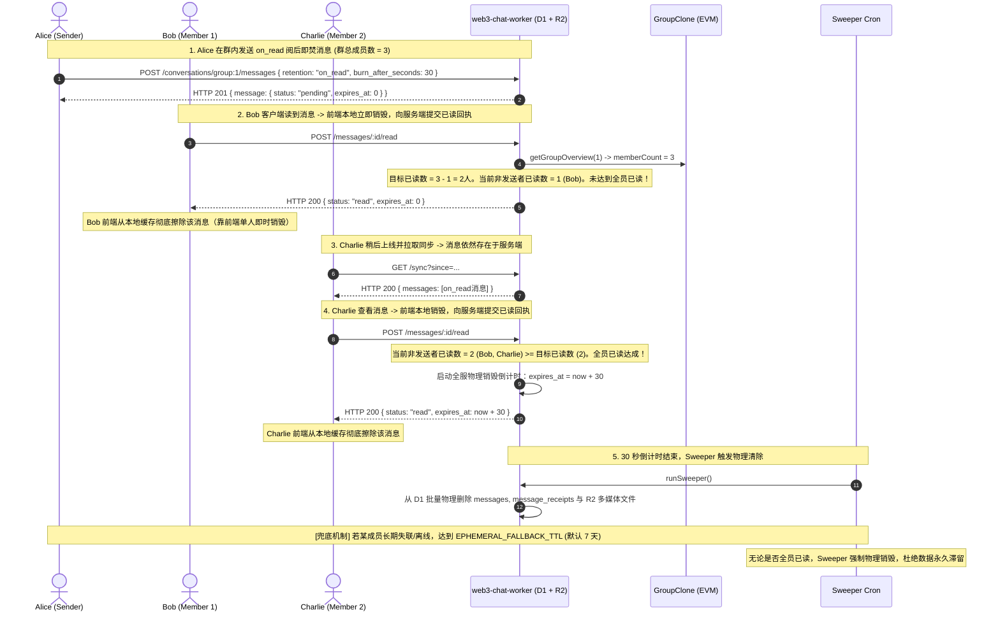

# Web3 Chat Protocol: Local Joint Test Architecture & Data Flow (ARCHITECTURE_FLOW.md)

本文档详细描述 **EVM 智能合约协议 (`web3-chat-contract`)** 与 **Cloudflare Worker 状态中继节点 (`web3-chat-worker`)** 在本地联合调试过程中的底层数据流转、时序交互与主权状态校验机制。

---

## 1. 核心架构设计理念

### 关键原则：
1. **主权在链（Sovereign on EVM）**：
   - 用户身份注册（`createUser`）、用户资料（`setMetadata`）、好友关系（`sendRequest` / `acceptRequest`）、拉黑（`blockUser` / `unblockUser`）。
   - 群组创建（`createGroup`）、群成员（`join` / `removeMember`）、群角色（`Role.OWNER / ADMIN / MODERATOR / MEMBER`）、群治理（`mute` / `ban`）、群生命周期（`pause` / `resume` / `close`）。
   - **Worker 数据库严禁本地复制/同步上述任何关系表**。
2. **轻量中继（Lightweight Transit Node）**：
   - Worker D1 仅存储消息中转体（`messages`）、临时鉴权会话（`sessions`）、投递与已读回执（`message_receipts`）及非链上客户端私有设置。
   - Worker R2 仅存储大容量语音、图片、文件二进制流和单用户活动头像。
3. **即时链上裁决（Live On-Chain Authorization）**：
   - 每次发信、加入群聊、同步查询，Worker 均通过 `@web3-chat/sdk` 实时或经由短 TTL 缓存校验链上主权状态。

---

## 2. 关键时序与业务交互

### 2.1 链上群组创建与 Worker 动态发现 (Dynamic Discovery)

---

### 2.2 链上黑名单即时拦截 (Real-Time Blacklist Enforcement)

---

### 2.3 链上群组禁言/封禁治理 (On-Chain Moderation Enforcement)

---

### 2.4 跨链上群组与私聊的增量时间戳同步 (Incremental Timestamp Sync)

---

### 2.5 阅后即焚 (on_read) 双轨生命周期：私聊 vs 群聊全员已读销毁与兜底过期协议

在点对点私聊与多人群聊场景下，阅后即焚（`retention: "on_read"`）具备严谨的差异化生命周期逻辑，兼顾区块链轻节点架构、前端体验与物理级数据隐私：

---

## 3. 安全与性能审计及加固设计 (Security & Performance Architecture Hardening)

经过双项目全面联合审计，针对链上合约协议与边缘计算节点实施了深度加固：

### 3.1 智能合约层 (`web3-chat-contract`) 安全与性能加固
1. **时间戳算术防溢出 (Arithmetic Overflow Prevention)**：
   - 在 `GroupImplementation._banMemberInternal` 与 `mute` 中，封堵了极端超大封禁/禁言时长传入时触发的 `uint64` 时间戳加法溢出，自动饱和截断至 `type(uint64).max`，杜绝 EVM Panic(0x11)。
2. **跨运行时密码学兼容 (Cross-Platform Cryptography)**：
   - 彻底移除了 SDK 中对 CommonJS `require("crypto")` 的依赖，全面采用标准 `globalThis.crypto.getRandomValues`，确保在 Node.js、浏览器以及 Cloudflare Worker 边缘沙箱中均能无缝零报错生成安全邀请码。
3. **O(1) 链上索引与无锁换位删除 (Swap-and-Pop Deletion)**：
   - 群成员、好友列表以及全局群组索引统一采用 1-based 映射哈希与数组尾部元素换位（swap-and-pop）操作，保证成员加入、退出、拉黑与解封的 Gas 开销恒定为 O(1)。

### 3.2 边缘节点层 (`web3-chat-worker`) 安全与性能加固
1. **Worker Isolate 级跨请求 TTL 缓存与 RPC 连接池复用**：
   - 重构 `ContractService`，将 TTL 缓存与 SDK 实例提升为 Isolate 静态生命周期。避免了每次 HTTP 请求反复重建客户端和清空缓存的问题，真正发挥了对 EVM RPC 节点的保护作用，并持续维护节点健康度与延迟监控。内置 10,000 条上限的自动修剪机制，杜绝内存泄漏。
2. **消灭 N+1 数据库查询 (Elimination of N+1 DB Roundtrips)**：
   - 在消息历史拉取（`getConversationMessages`）与全量增量同步（`SyncService.sync`）中，重构为 `MessageService.enrichMediaMessages` 并行批处理，通过 `WHERE message_id IN (...)` 聚合查询多媒体元数据，将查询延迟从 O(N) 降低至 O(1)。
3. **原子批量过期清理 (Atomic Batch Purge in Sweeper)**：
   - `SweeperService` 由原先的循环单条删除重构为 Cloudflare D1 `env.DB.batch(...)`，在单次 SQLite 事务中完成所有语音、图片、文件元数据与消息行的双向同步销毁。
4. **单次 JOIN 媒体流验证 (Single JOIN Media Streaming)**：
   - `/voice/:id`、`/images/:id`、`/files/:id` 路由优化为单条 SQL `LEFT JOIN` 联合查询，合并消息销毁状态核验与媒体元数据提取，减少 50% 边缘数据库网络交互。
5. **严密增量同步游标 (Incremental Sync Pagination Guard)**：
   - 修复了分页拉取达到 `limit` 时游标直接跳至 `now` 导致消息漏拉的安全隐患：当消息数达到分页上限时，游标精准对齐返回批次中的最新更新时间戳，并附带 `has_more: true` 标记。
6. **全维度输入边界防护与 DoS 阻断 (Input Validation & DoS Mitigation)**：
   - 文本消息内容严格限制 32KB，防止超大字符串造成 D1 存储膨胀；媒体文件强制限制 50MB，头像限制 5MB，用户扩展元数据限制 16KB；分页 `limit` 施加 [1, 100] 范围钳制。
7. **并发 Nonce 竞态原子防重放 (Atomic Nonce Single-Use)**：
   - 鉴权校验中加入 `deleteResult.meta.changes > 0` 严格核验，防止并发竞争条件下同一 Nonce 被多次利用。
8. **D1 SQLite 复合索引优化**：
   - 增设 `idx_nonces_wallet_nonce` 唯一复合索引与 `idx_messages_content` 索引，确保鉴权挑战与媒体反向寻址均为 O(1) 索引命中。
9. **群聊阅后即焚全员已读销毁与兜底安全生命周期 (Group on_read Lifecycle & Fallback TTL)**：
   - 区分 1v1 私聊与多人群聊：私聊仅由接收方已读触发倒计时（发送方标记已读不误触）；群聊端侧各自已读各自本地立即销毁，服务端在全员（`memberCount - 1`）读毕后方启动 30 秒全局倒计时物理销毁；并引入 `EPHEMERAL_FALLBACK_TTL_SECONDS`（默认 7 天），防止离线成员造成数据长期驻留。

